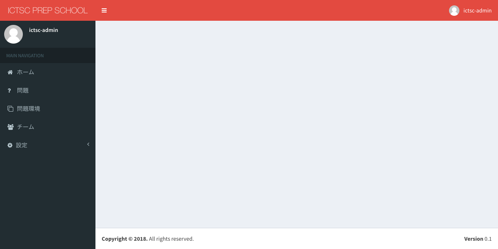

Gitリポジトリからの問題・チームの一括追加
==================================

概要
----------------------------
この機能は予選で扱う問題とチームを一括で追加する機能です。

Gitの情報追加
----------------------------

この情報を元にリポジトリをPullし該当のチームと問題を追加します。
※ログインをしていることが必要です。

1.画面左部サイドバーの「設定->Github」を選択します。

2.画面右部の「追加」を選択します。

3.フォームに値を入力します。
  問題情報が保存されているリポジトリには下記の内容があります
- /Project root path/teams.yml
- /Project root path/q1/Problem code/000/main.tf

.. csv-table::
   :header: 項目, 入力する値
   :widths: 5, 5

   Name, チーム名にしたい文字列
   Git source, Pullするリポジトリ先。SSHで書くこと
   SSH private key, リポジトリの秘密鍵を追加する
   Project root path, ictscXXXX
   Teams file, チームの情報が定義されているyamlのファイル名
   Problem path, 問題コードのディレクトリが保存されている場所
|

  
4.画面左下部の「追加」を選択します。

5.画像と同じ状態に遷移したことを確認します。

チームの一括追加
----------------------------

※ログインしていることとGitの情報を既に追加していることが前提です。

1.画面左部サイドバーの「チーム」を選択します。

2. 画面右部の「Bulk Add」を選択します。

3. Pullする先のGithubの情報を選択し、確認を押します

4. 全チームが追加されていることを確認します

問題の一括追加
----------------------------

※ログインしていることとGitの情報を既に追加していることが前提です。
1.画面左部サイドバーの「問題」を選択します。

2. 画面右部の「Bulk Add」を選択します。

3. Pullする先のGithubの情報と利用するさくらクラウドのproviderを選択し、確認を押します

4. 全問題が追加されていることを確認します

