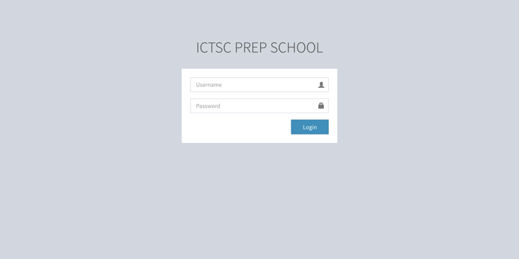
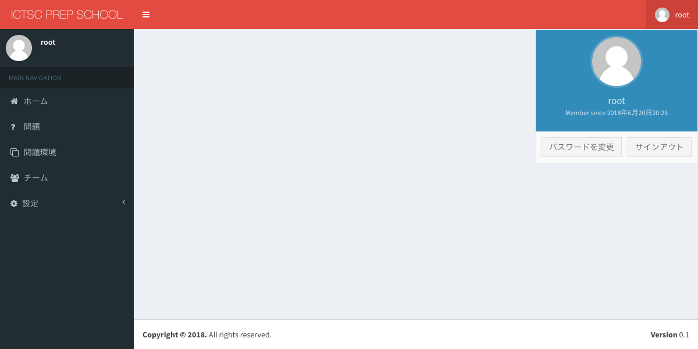
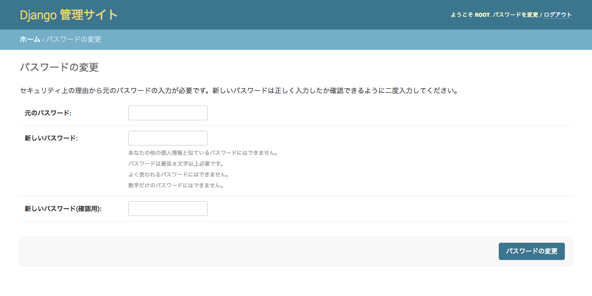
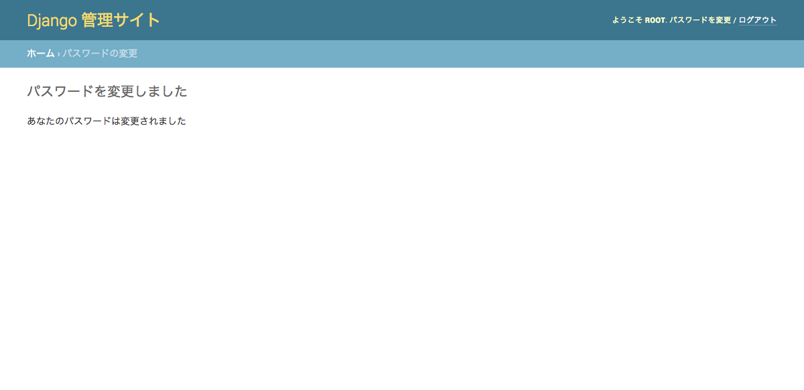

.. include:: ../../definition.txt

管理者ガイド
============================

ログイン
----------------------------

1.URL「|PSTATE_TOP_URL_PRODUCTION|」にアクセスし、UsernameとPasswordを入力します。
入力後に、Loginボタンを選択します。

2.画像と同じ状態に遷移したことを確認します。

.. image:: ../../image/admin/auth/6.png

ログアウト
----------------------------

1.画面右上部のユーザ名「root」部分を選択し、サインアウトを選択します。

2.画像と同じ状態に遷移したことを確認します。

パスワード変更
----------------------------

1.画面右上部のユーザ名「root」部分を選択し、パスワードを変更を選択します。

2.「元のパスワード」に現在のパスワードを入力し、「新しいパスワード」に新しく設定するパスワードを入力し、「パスワードの変更」を選択します。

3.画像と同じ状態に遷移したことを確認します。

4.ログイン後に元のページに戻る場合は、URL「|PSTATE_TOP_URL_PRODUCTION|」にアクセスします。

.. image:: ../../image/admin/auth/6.png