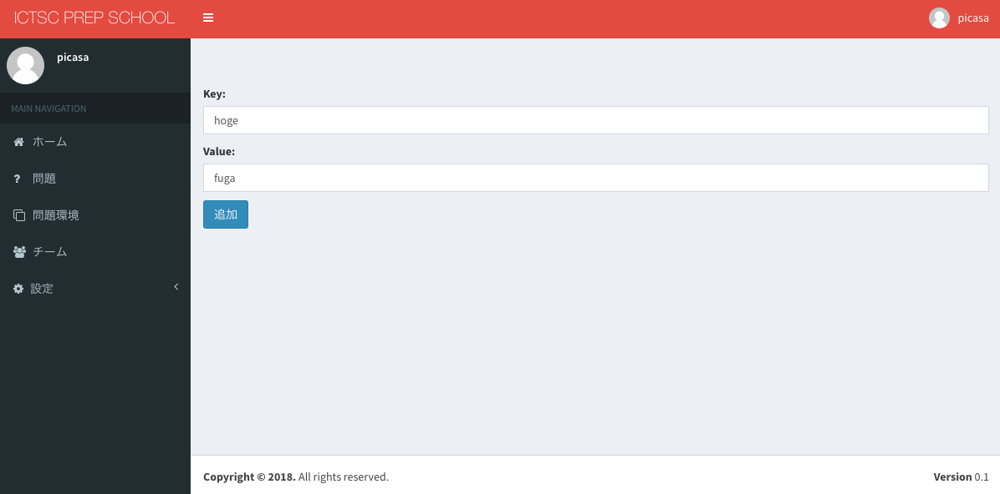

問題
============================

問題の追加
----------------------------
※ログインをしていることが前提です。

1.画面左部サイドバーの「問題」を選択します。

.. image:: ../../image/admin/problem/new/1.png

2.画面右部の「追加」を選択します。

3.フォームに値を入力します。

.. csv-table::
   :header: 項目名, 入力する値
   :widths: 5, 15

   問題名(管理用), 問題名(管理用)にしたい文字列
   問題名(参加者向け), 問題名(参加者向け)したい文字列
   問題文, 問題文本文
   公開モード, 問題の公開状態(追加時は非公開を選択)
   問題公開日時, 問題を公開する時間(公開モードで時間指定公開選択時に有効になります)
   問題公開終了日時, 問題の公開を終了する時間(公開モードで時間指定公開選択時に有効になります)

公開モードについて
^^^^^^^^^^^^^^^^^^^^^^^^^^^^
.. csv-table::
   :header: モード名, 説明
   :widths: 5, 15

   公開, 公開状態
   非公開, 非公開状態
   時間指定公開, 問題公開/問題公開終了日時の設定にしたがって問題の公開・非公開を行います

4.画面下部の「追加」を選択します。

5.問題が追加されたことを確認します。

問題の編集
----------------------------
※ログインをしていることが必要です。

1.画面左部サイドバーの「問題」を選択します。

.. image:: ../../image/admin/problem/new/1.png

2.問題の「ID」または、「問題名」を選択します。

問題文
^^^^^^^^^^^^^^^^^^^^^^^^^^^^

2-1.画面右部の「編集」を選択します。

.. image:: ../../image/admin/problem/4.png

2-2.問題文を入力し、画面下部の「更新」を選択します。

2-3.問題文が更新されたことを確認します。

問題名と公開モード
^^^^^^^^^^^^^^^^^^^^^^^^^^^^

2-1.「問題情報」タブを選択し、画面右部の「編集」を選択します。

.. image:: ../../image/admin/problem/new/6.png

2-2.編集したい項目に値を入力し、画面下部の更新を選択します。

.. image:: ../../image/admin/problem/new/7.png

2-3.更新されたことを確認します。

TerraformFile
^^^^^^^^^^^^^^^^^^^^^^^^^^^^

2-1.画面右下部の「追加」を選択します。

.. image:: ../../image/admin/problem/4.png

2-2.フォームに値を入力します。

.. csv-table::
   :header: 項目名, 入力する値
   :widths: 5, 5

   Name, 名前にしたい文字列を入力
   File name, ファイル名にしたい文字列を入力(.tf拡張子は不要)
   Provider, さくらのクラウドを選択
   Body, Terraformのコードを入力

.. image:: ../../image/admin/problem/11.png

Providerは、プルダウンメニューから「さくらのクラウド」を選択してください。

2-3.画面下部の「追加」を選択します。

2-4.問題画面でリロードを行い、Terraformのコードが追加されたことを確認します。

※画面下部

Terraformで使用するシェルスクリプト
^^^^^^^^^^^^^^^^^^^^^^^^^^^^^^^^^^^^^^^^^^^^^^^^^^^^^^^^

2-1.「Terraform - ShellScript」タブを選択し、画面右部の「追加」を選択します。

.. image:: ../../image/admin/problem/19.png

2-2.フォームに値を入力します。

.. csv-table::
   :header: 項目名, 入力する値
   :widths: 5, 5

   Name, 名前にしたい文字列を入力
   File name, ファイル名にしたい文字列を入力(.sh拡張子は必要)
   Body, スクリプトを入力

2-3.問題画面でリロードを行い、「Terraform - ShellScript」タブを選択し「ShellScript」が追加されたことを確認します。

Terraformで使用する変数
^^^^^^^^^^^^^^^^^^^^^^^^^^^^

2-1.「Terraform - Variables」タブを選択し、画面右部の「追加」を選択します。

2-2.フォームに値を入力し、画面下部の「追加」を選択します。

.. csv-table::
   :header: 項目名, 入力する値
   :widths: 5, 5

   Key, キー名
   Value, 値

2-3.問題画面でリロードを行い、「Terraform - Variables」タブを選択し「Variables」が追加されたことを確認します。

2-4.定義した変数は、問題環境作成時に以下のような形式でTerraformが実行されるディレクトリに配置されます。

.. code-block:: bash

   variable "hoge" {
     default = "fuga"
   }

問題画面のプレビュー
----------------------------

1.画面右上部の「プレビュー」を選択します。

2.問題画面のプレビューが表示されていることを確認します。

問題のテスト実行
----------------------------

1.画面右上部の「テスト実行」を選択します。

.. image:: ../../image/admin/problem/4-2.png

2.「実行」を選択します。

3.問題環境のページに遷移したことを確認します。

これにより、Terraformの定義に従って問題環境作成が開始されます。

問題環境の作成
----------------------------

1.画面右上部の「問題環境の作成」を選択します。

2.「Team」から、問題環境を割り当てるチームを選択します。

3.画面下部の「追加」を選択します。

3.問題環境のページに遷移したことを確認します。

これにより、Terraformの定義に従って問題環境作成が開始されます。

問題の削除
----------------------------

1.画面左部サイドバーの「問題」を選択します。

.. image:: ../../image/admin/auth/6.png

2.問題の「ID」または、「問題名」を選択します。

3.画面右部の「削除」を選択します。

4.「確認」を選択します。

