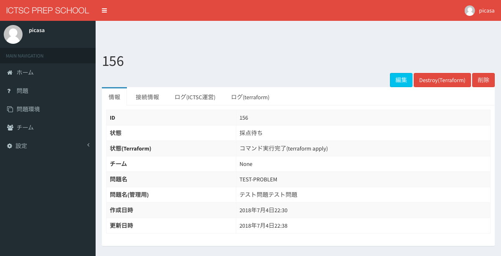

.. include:: ../../definition.txt

問題環境
============================

問題環境は、問題を元に各チームごとに独立して作成された問題環境に関する操作と情報を提供します。

問題環境の情報
----------------------------

1.画面左部サイドバーの「問題環境」を選択します。

.. image:: ../../image/admin/problem_environment/1.png

2.問題環境の「ID」を選択します。

3.「情報」タブでは、以下の情報が提供されます。

.. csv-table::
   :header: 項目名, 説明
   :widths: 5, 5

    状態, 問題環境の状態(問題のライフサイクル)
    状態(Terraform), 問題環境の作成状態(Terraformの実行状態)
    チーム, 問題環境が割り当てられたチームID
    問題名, 問題名
    問題名(管理用), 問題名(管理用)
    作成日時, 問題環境が作成開始された日時
    更新日時, 問題環境の状態が更新された日時

.. image:: ../../image/admin/problem_environment/7.png

4.「接続情報」タブでは、以下の情報が提供されます。

.. csv-table::
   :header: 項目名, 説明
   :widths: 5, 10

   VNC IPアドレス, 踏み台サーバへVNC接続する際に使用する
   VNC ポート番号, 踏み台サーバへVNC接続する際に使用する
   VNC 接続ユーザ名, 踏み台サーバへVNC接続する際に使用する
   VNC 接続パスワード, 踏み台サーバへVNC接続する際に使用する

5.「ログ(ICTSC運営)」タブでは、問題環境の状態の変更記録情報が提供されます。

6.「ログ(terraform)」タブでは、terraformコマンドの実行結果(stderr/stdout)の情報が提供されます。

問題のライフサイクル
----------------------------
pstateでは、問題環境のライフサイクルが以下のように定義されています。

通常は、表の上から下にしたがって状態が遷移します。

.. csv-table::
   :header: 状態名, 説明
   :widths: 15, 15

    準備中, 問題環境の作成中
    準備完了, 問題環境の作成完了
    問題進行中, 参加者による問題挑戦が開始
    終了, 参加者による問題挑戦が終了
    採点待ち, 問題の採点待ち
    採点終了, 問題の採点終了
    削除待ち, 問題環境の削除待ち
    削除完了, 問題環境が削除完了

Terraformの実行状態
----------------------------

pstateでは、Terraformの実行の状態が以下のように定義されています。

問題環境作成時には、表の上から下にしたがって実行状態が遷移します。

.. csv-table::
   :header: 状態名, 説明
   :widths: 15, 15

    問題環境作成開始待ち, 問題環境作成処理がキューイングされる
    ファイルコピー中, terraformの実行に必要なファイルのコピー
    コマンド実行中(terraform init), コマンドの実行中
    コマンド実行完了(terraform init), コマンドの実行終了
    コマンド実行中(terraform plan), コマンドの実行中
    コマンド完了(terraform plan), コマンドの実行終了
    コマンド実行中(terraform apply), コマンドの実行中
    コマンド実行完了(terraform apply), コマンドの実行終了

また以下の2つの状態については、任意のタイミングまたは何らかのエラーが発生した場合に遷移します。

.. csv-table::
   :header: 状態名, 説明
   :widths: 10, 10

    コマンド実行中(terraform destroy), コマンドの実行中
    コマンド完了(terraform destroy), コマンドの実行終了
    失敗, コマンドの実行に失敗

問題環境状態の変更
----------------------------

1.画面右上部の「編集」を選択します。

2.プルダウンメニューから、変更したい状態にを選択します。

3.画面下部「更新」を選択します。

.. image:: ../../image/admin/problem/36.png

4.状態が変更されたことを確認します。

問題環境の再作成
----------------------------

1.問題環境を再作成したい問題環境詳細画面にて、画面右上部の「問題環境の再作成」を選択します。

.. image:: ../../image/admin/problem_environment/7.png

2.「実行」を選択します。

3.新しい問題環境詳細画面に遷移したことを確認します。

問題環境の削除
----------------------------

1.画面右上部の「削除」を選択します。

2.「確認」を選択します。

.. image:: ../../image/admin/problem/41.png

3.問題環境が削除されたことを確認します。

問題環境情報取得API
----------------------------

.. csv-table::
   :header: 項目名, 説明
   :widths: 5, 30

   Endpoint, |PSTATE_TOP_URL_PRODUCTION|/manage/api/problem_environments/
   認証, Basic認証
   Username, pstateの管理者権限のあるログインID
   Password, pstateの管理者権限のあるログインIDのパスワード

レスポンス例

.. code-block:: bash

   [
     {
       "id": 220,
       "vnc_server_ipv4_address": "133.242.228.30",
       "vnc_server_password": "DTORGj6mlEzHGo",
       "state": "READY",
       "terraform_state": "APPLIED",
       "problem": "WP : ブログを移設してください。",
       "team": "team"
     }
   ]
