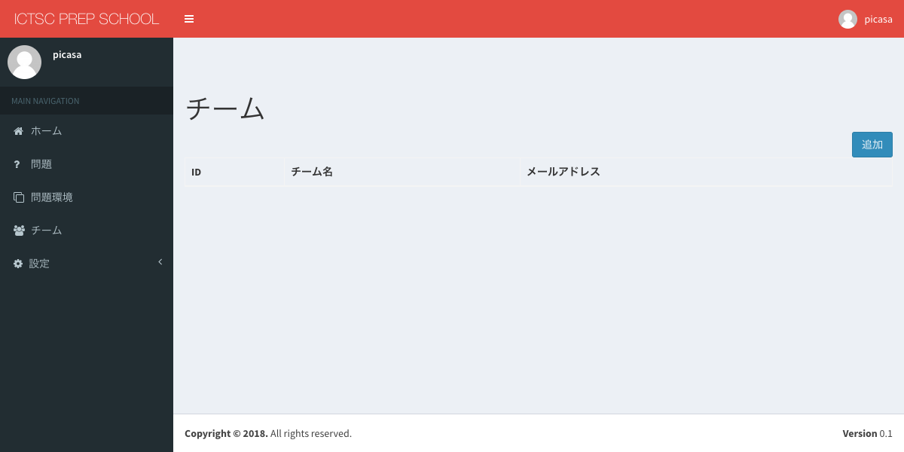
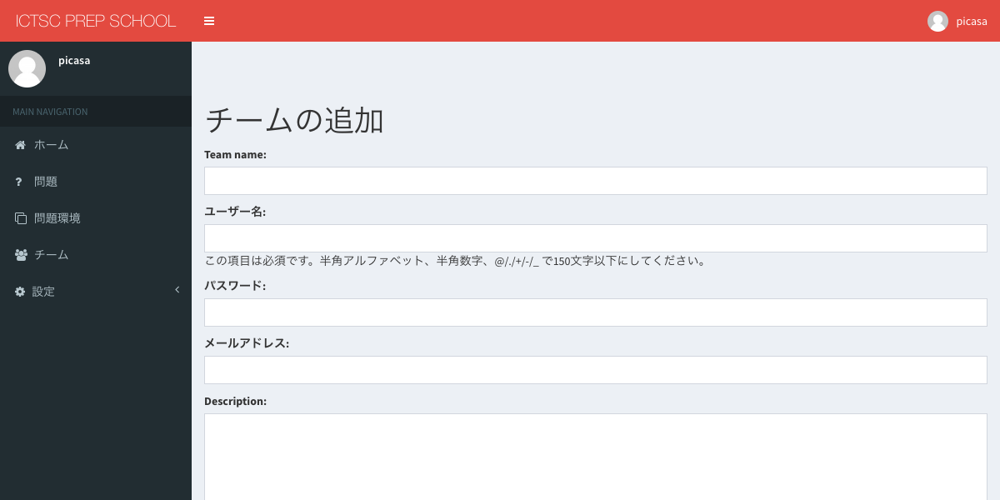
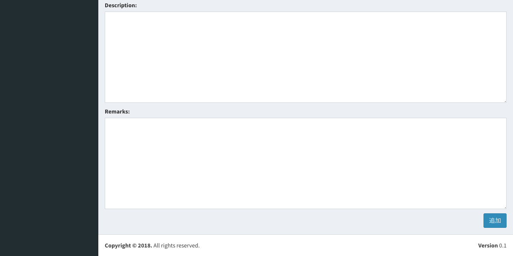
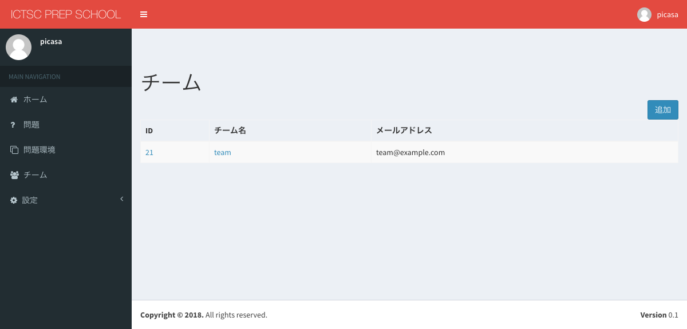
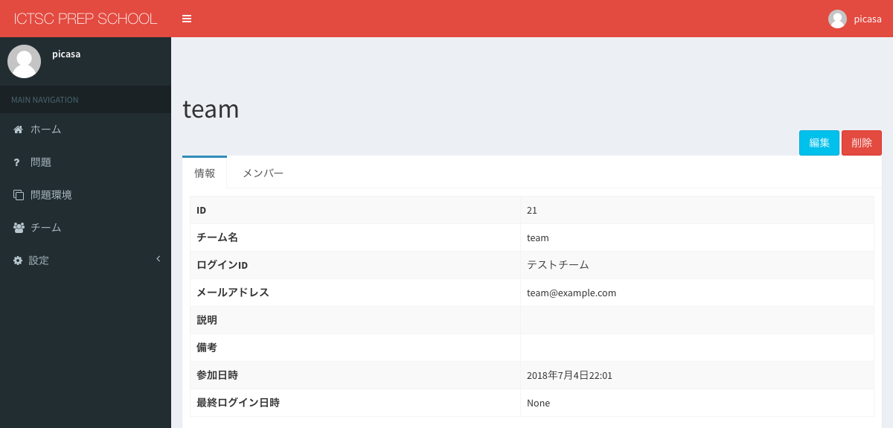
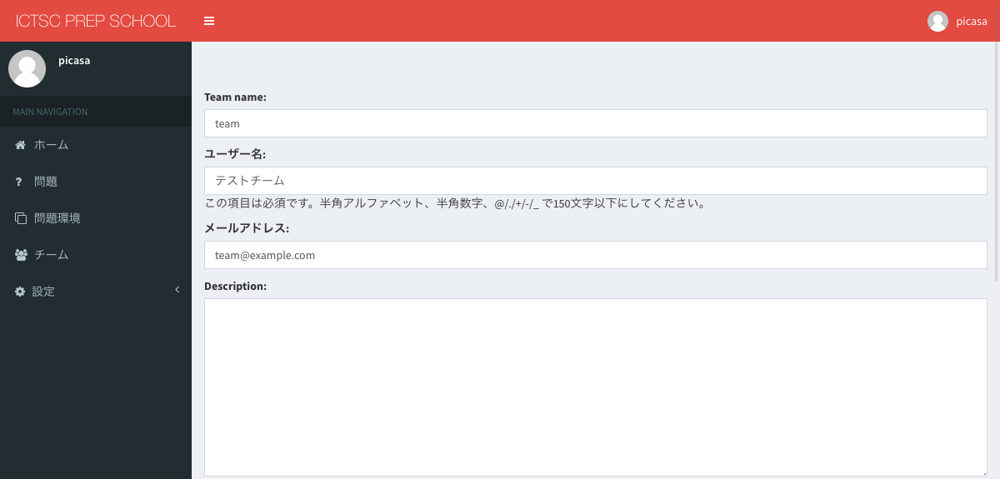
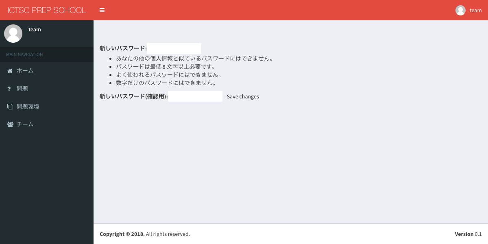
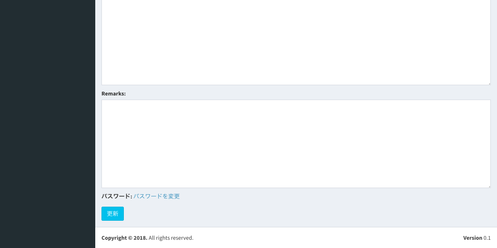
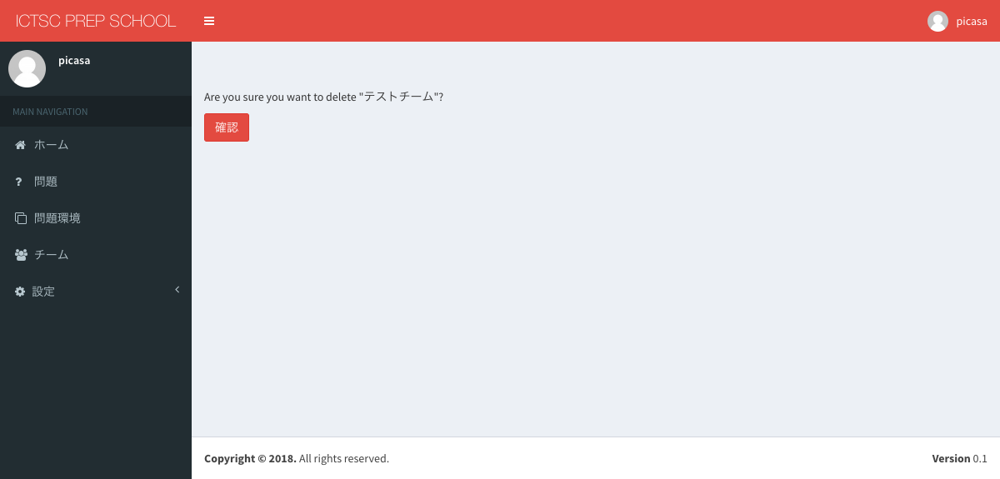

チーム
============================

チームの追加
----------------------------
※ログインをしていることが必要です。

1.画面左部サイドバーの「チーム」を選択します。

.. image:: ../../image/admin/auth/6.png

2.画面右部の「追加」を選択します。

3.フォームに値を入力します。

.. csv-table::
   :header: 項目名, 入力する値
   :widths: 5, 5

   Team name, チーム名にしたい文字列
   ユーザー名, ログインIDにしたい文字列
   パスワード, ログインパスワードにしたい文字列
   メールアドレス, チームの連絡先メールアドレス
   Description, 説明
   Remarks, 備考

4.画面右下部の「追加」を選択します。

5.画像と同じ状態に遷移したことを確認します。

チームの情報
----------------------------
※ログインをしていることが必要です。

1.画面左部サイドバーの「チーム」を選択します。

.. image:: ../../image/admin/auth/6.png

2.チームの「ID」または、「チーム名」をクリックします。

3.チームの情報が閲覧できることを確認します。

チームの編集
----------------------------
※ログインをしていることが必要です。

1.画面左部サイドバーの「チーム」を選択します。

.. image:: ../../image/admin/auth/6.png

2.チームの「ID」または、「チーム名」をクリックします。

3.画面右部の「編集」を選択します。

4.変更したい値のフォームに値を入力します。

.. csv-table::
   :header: 項目名, 入力する値
   :widths: 5, 5

   Team name, チーム名にしたい文字列
   ユーザー名, ログインIDにしたい文字列
   パスワード, ログインパスワードにしたい文字列
   メールアドレス, チームの連絡先メールアドレス
   Description, 説明
   Remarks, 備考

「パスワード」を変更する場合は、パスワードを変更をクリックします。

「新しいパスワード」と「新しいパスワード(確認用)」に新しいパスワードを入力し、「Save changes」を選択します。

5.画面下部の「更新」を選択します。

6.画像と同じ状態に遷移したことを確認します。

チームの削除
----------------------------
※ログインをしていることが必要です。

1.画面左部サイドバーの「チーム」を選択します。

.. image:: ../../image/admin/auth/6.png

2.チームの「ID」または、「チーム名」をクリックします。

3.画面右部の「削除」を選択します。

4.「確認」を選択します。

5.画像と同じ状態に遷移したことを確認します。

