VNCサーバイメージの作成方法
============================

VNCサーバイメージの元となるサーバの作成
----------------------------------------

1.コントロールパネルサイドメニューから、サーバを選択します。

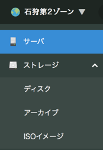

2.コントロールパネル右上部の追加を選択します。

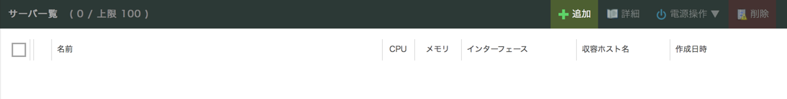

3.画面遷移後、サーバプランの仮想コアを「2コア」、メモリを「2GB」で選択します。

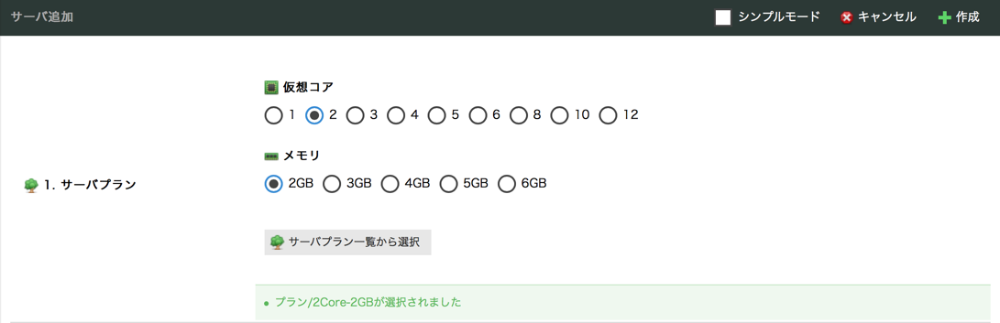

4.ページをスクロールし、ディスクのアーカイブ選択で「Ubuntu Server 16.04.4 LTS 64bit」を選択します。

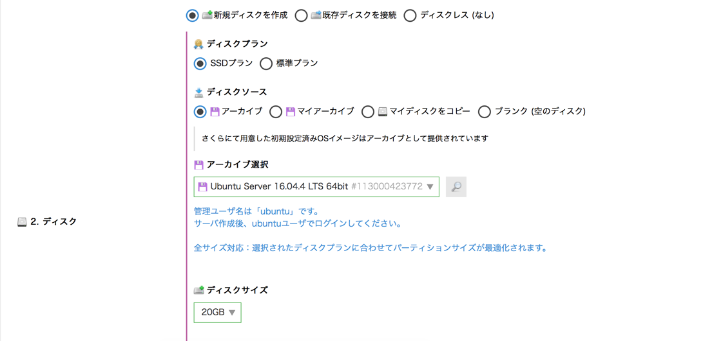

5.ページをスクロールし、ディスクの修正でディスクを修正するにチェックを入れ、管理ユーザのパスワード()を入力します。

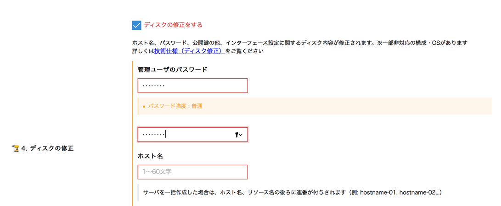

6.スタートアップスクリプトで、shellを選択し、配置するスタートアップスクリプトで「startup_base.sh」を選択します。

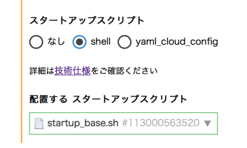

7.ページをスクロールし、サーバの情報で名前に「vnc image base」を入力します。

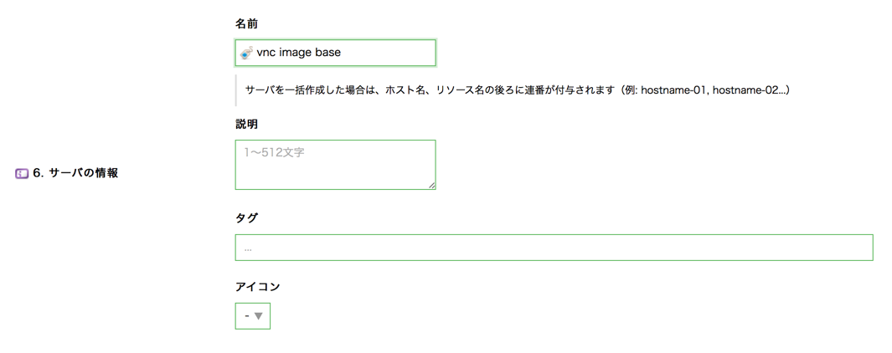

8.ページをスクロールし、コントロールパネル右下部の作成を選択します。

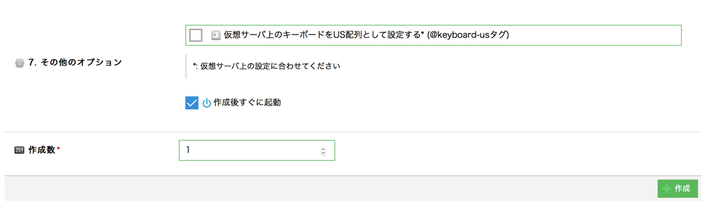

9.閉じるを選択します。

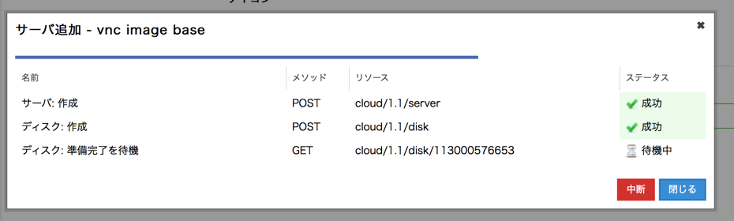

10.コントロールパネルサイドメニューから、サーバを選択します。

11.作成したサーバが稼働中になってから、サーバ名を選択します。

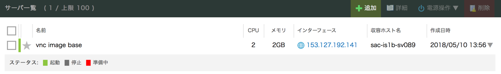

12.画面遷移後、タブからコンソールを選択し、コンソールが画像と同じ状態になっていることを確認します。

もし、なっていない場合はセットアップ中のため待ちます。

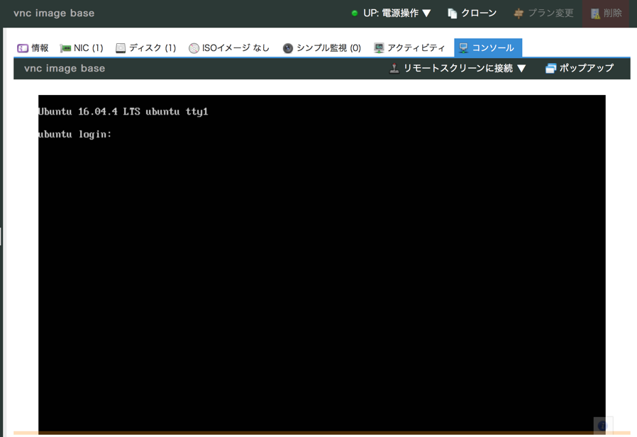

13.12でコンソールの状態の確認後、コントロールパネル上部の電源操作を選択しシャットダウンを選択します。

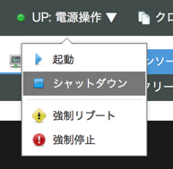

14.実行を選択します。

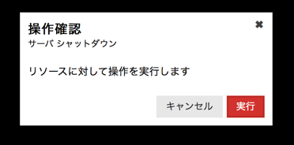

15.ステータスが成功になっていることを確認します。

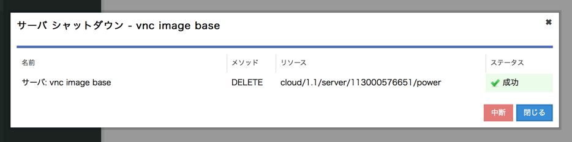

以上でVNCサーバイメージの元となるサーバの作成は完了です。

サーバからVNCサーバイメージの作成
----------------------------------------

1.コントロールパネルサイドメニューから、ストレージ→アーカイブを選択します。

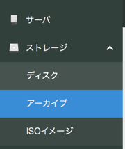

2.コントロールパネル右上部の追加を選択します。

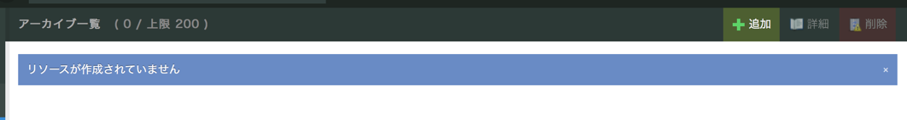

3.画面遷移後、アーカイブソースから先ほど作成したサーバを選択します。

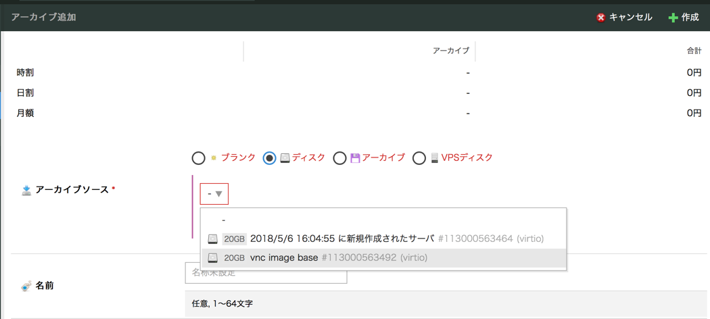

4.名前には「VNC IMAGE」と入力し、コントロールパネル右下部の作成を選択します。

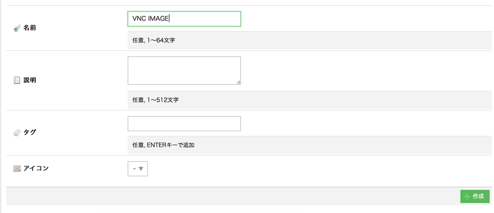

以上でVNCサーバイメージの作成は完了です。

VNCサーバイメージのリソースIDの確認方法
----------------------------------------

1.コントロールパネルサイドメニューから、ストレージ→アーカイブを選択します。

2.名前がVNC IMAGEのアーカイブを選択します。

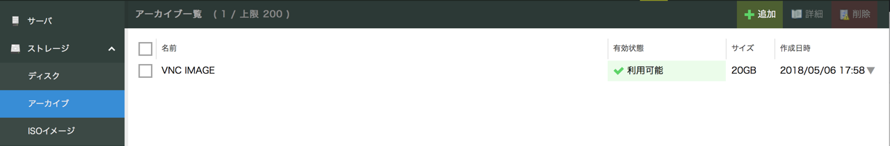

3.情報の一番上の「リソースID」がVNCサーバイメージのアーカイブのリソースIDになります。

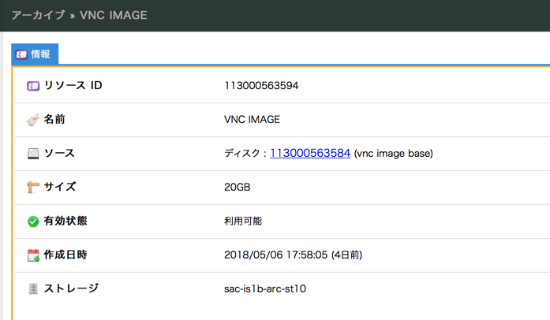