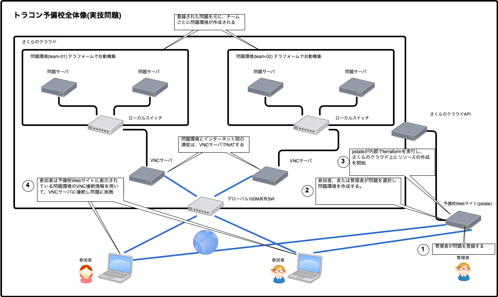

概要
=========

　pstate(実技問題管理システム)では、システムにあらかじめ登録された問題を参加者がオンデマンドに挑戦できるシステムです。
　
　問題は、Terraformとシェルスクリプトによって構成されます。
　
　参加者が問題を開始した時点で、Terraformとシェルスクリプトによりクラウド環境上に問題環境が構築されます。

　問題環境は、外部からは直接アクセスできないローカルネットワークに構築され、アクセスするためにVNCサーバ(以下、踏み台サーバ)にログインし
踏み台サーバから問題を挑戦します。

全体像と流れ
------------

1.管理者は、pstateに対して問題を作成し登録します。
問題の作成には、以下が必要になります。

- 問題名
- 問題文
- Terraform
- 問題を構築するシェルスクリプト

2.管理者は、登録した問題から問題環境を作成しチームに割り当てます。

3.pstateでは問題環境作成の指示を受け、内部で以下のterraformコマンドを実行し問題環境を作成します。

- terraform init
- terraform plan
- terraform apply

4.参加者はpstateにアクセスし問題環境のページの接続情報を参照し、踏み台サーバにログインし問題に挑戦します。

用語説明
------------

.. csv-table::
   :header: 用語, 説明
   :widths: 5, 15

    問題環境, 問題がデプロイされた環境のセット。
    踏み台サーバ, 問題を挑戦するためにログインするサーバ。
