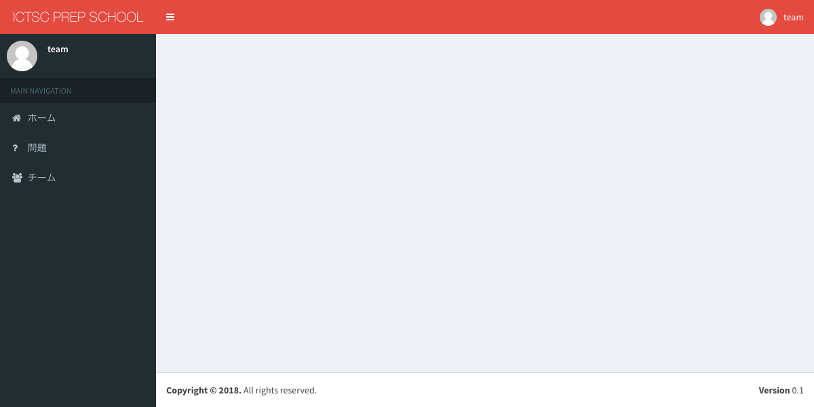
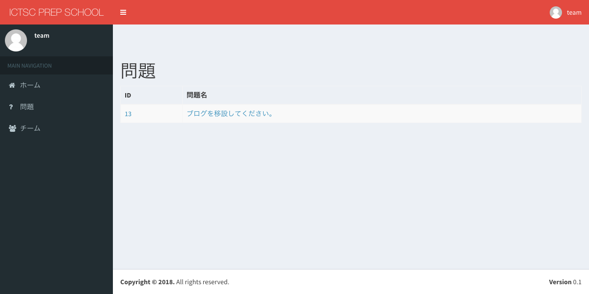
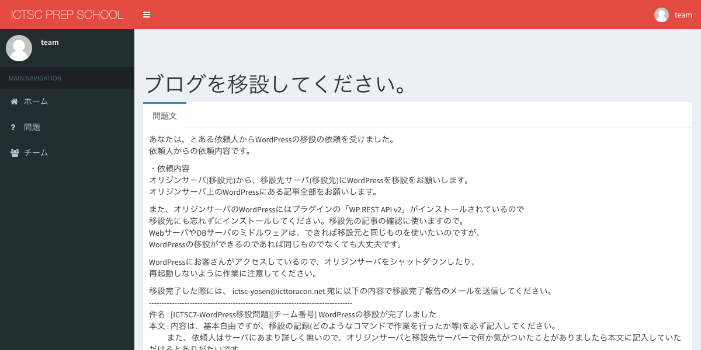
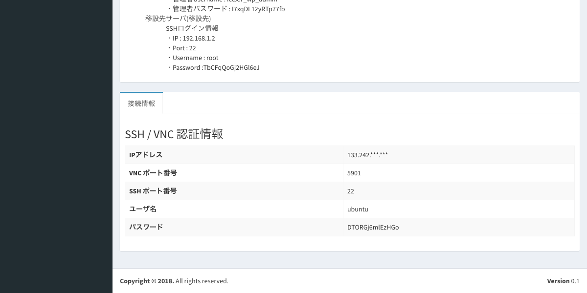

問題
============================

問題の情報
----------------------------

1.画面左部サイドバーの「問題」を選択します。

2.問題の「ID」または、「問題名」を選択します。

3.問題名と問題文が表示されていることを確認します。

4.スクロールし、画面下部に「接続情報」が表示されていることを確認します。

「接続情報」タブでは、以下の情報が提供されます。

.. csv-table::
   :header: 項目名, 説明
   :widths: 5, 15

   IPアドレス, 踏み台サーバへ接続する際に使用する
   VNC ポート番号, 踏み台サーバへVNC接続する際に使用する
   SSH ポート番号, 踏み台サーバへSSH接続する際に使用する
   ユーザ名, 踏み台サーバへSSH/VNC接続する際に使用する
   パスワード, 踏み台サーバへSSH/VNC接続する際に使用する
