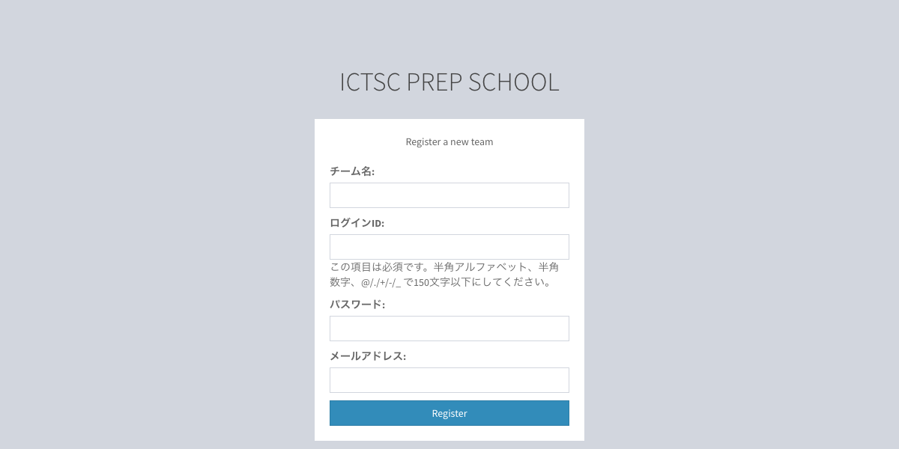
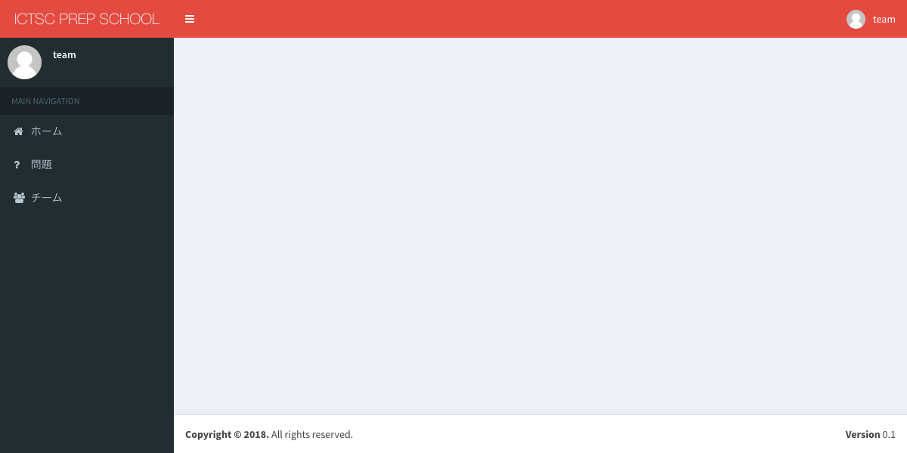
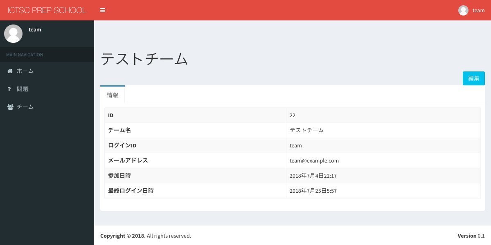
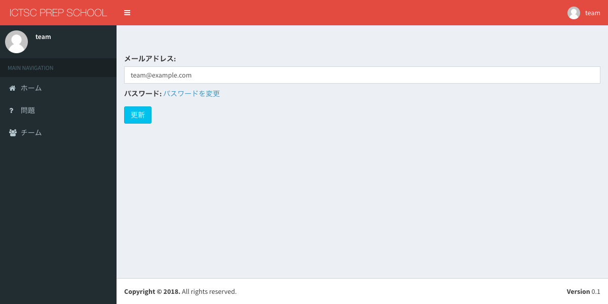
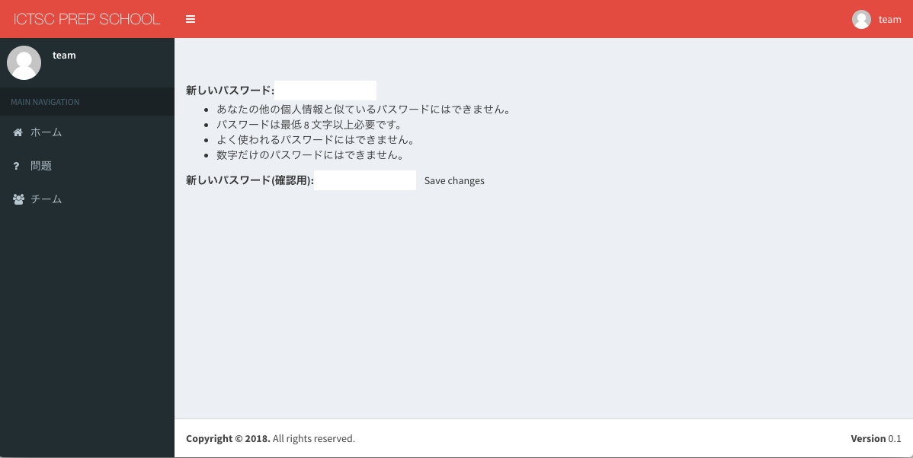

.. include:: ../../definition.txt

チーム
============================

チームの登録
----------------------------

1.URL「|PSTATE_REGISTER_TEAM_URL_PRODUCTION|」にアクセスします。

アクセス後フォームに値を入力します。

.. csv-table::
   :header: 項目名, 入力する値
   :widths: 5, 5

   チーム名, チーム名にしたい文字列
   ログインID, ログインIDにしたい文字列
   パスワード, ログインパスワードにしたい文字列
   メールアドレス, チームの連絡先メールアドレス

入力後、「Register」を選択します。

2.画像と同じ状態に遷移したことを確認します。

チームの情報
----------------------------
※ログインをしていることが必要です。

1.画面左部サイドバーの「チーム」を選択します。

2.チームの情報が閲覧できることを確認します。

チームの編集
----------------------------
※ログインをしていることが必要です。

1.画面左部サイドバーの「チーム」を選択します。

2.画面右上部の「編集」を選択します。

3.「メールアドレス」・「パスワード」を変更することができます。

「メールアドレス」は変更したい値を入力し、更新を選択します。

4.「パスワード」を変更する場合は、パスワードを変更をクリックします。

「新しいパスワード」と「新しいパスワード(確認用)」に新しいパスワードを入力し、「Save changes」を選択します。

